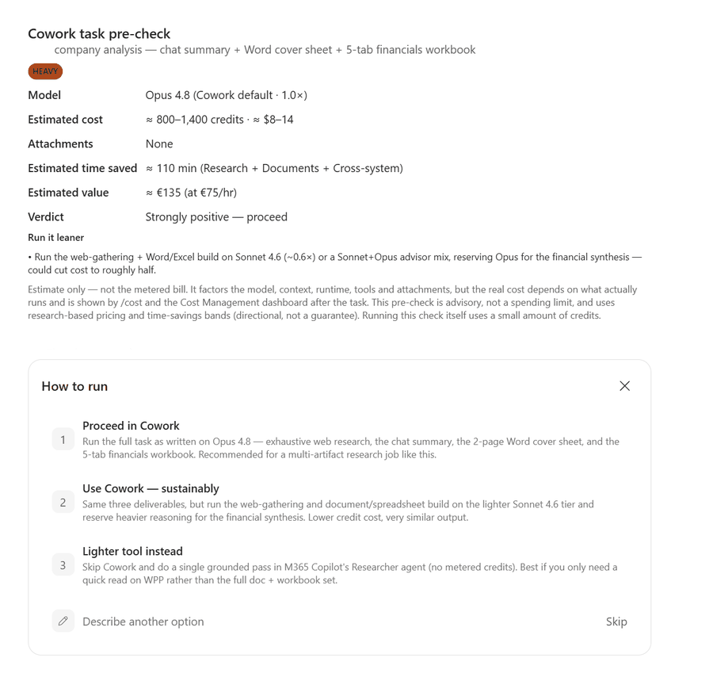
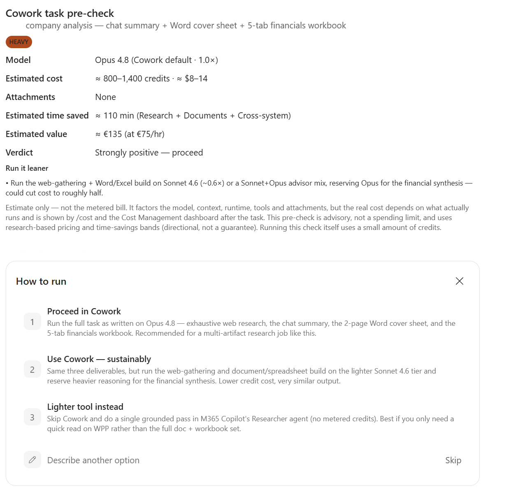
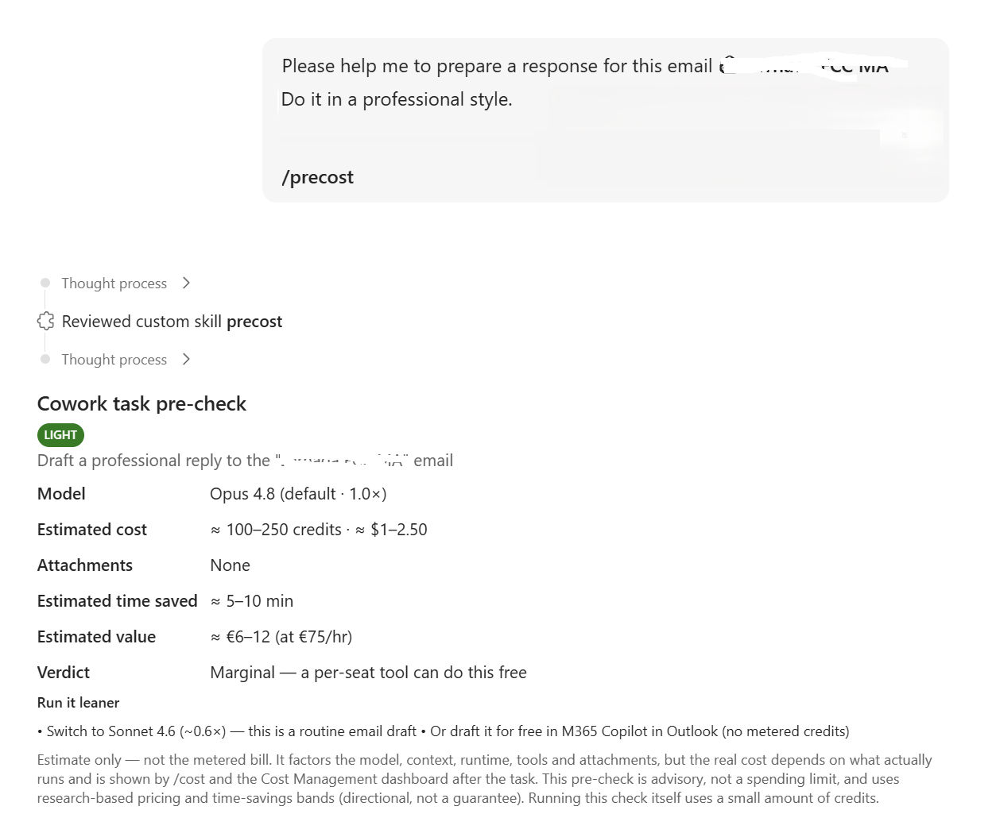
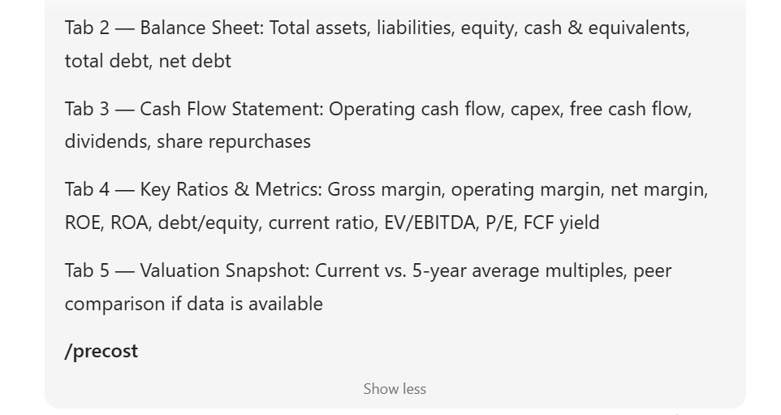

# Cowork Pre-cost Skill

<p align="center">
  
</p>

A custom **Copilot Cowork** skill that estimates what a task will likely **cost
and return _before_ you run it** — so you can decide whether to proceed in Cowork,
run it in a leaner way, or use Microsoft 365 Copilot / Copilot Chat instead.

Type `/precost` before a task and you get a quick, visual pre-check: a Light /
Medium / Heavy rating, an estimated credit + dollar range, estimated time saved,
estimated business value, and a clear recommendation.

> [!IMPORTANT]
> **Pre-cost is not an official Microsoft skill or a productized Microsoft
> feature.** It is an incubation skill I created — similar to something any user
> could build and adapt for their own workflow. All outputs are **estimates
> only**. The real cost always depends on the prompt, context, documents, tools
> used, model behavior, runtime and final execution.
>
> This repository exists for **learning, experimentation and demonstration**
> purposes only.

---

## What it does

Cowork tasks are billed by usage in **Copilot Credits**. Credits are valuable,
and once a task runs they're spent. Cowork already ships with a built-in
**`/cost`** command that tells you how many credits a task used — but only
*after* it has finished.

**Pre-cost moves the cost conversation earlier.** It looks at the task you're
about to delegate and gives you a directional estimate up front, plus a
recommendation:

- ✅ **Proceed in Cowork** — the task is a good fit and the time saved is worth it.
- 🌱 **Proceed in Cowork, but leaner** — same outcome, fewer credits (e.g. a
  lighter model, a converted attachment, tighter scope).
- 💬 **Use Microsoft 365 Copilot / Copilot Chat instead** — a small task a
  per-seat tool can do with no metered Cowork credits.
- ✂️ **Simplify or split the task** — it's too big or broad as written.

The goal is **not** to predict the exact cost perfectly. The goal is to help you
make a better decision before spending credits.

---

## Why this exists

- **Credits are a real budget.** Every Cowork task consumes metered Copilot
  Credits. Small, casual tasks can quietly add up.
- **`/cost` is useful but reactive.** It's a receipt. By the time you see it, the
  credits are already gone.
- **Pre-cost is a pre-check.** It gives you a heads-up *before* you spend, so the
  expensive runs are the ones that are actually worth it — and the cheap stuff
  goes to a tool that doesn't burn credits.

Think of it as a lightweight gate at the start of a task, not a brake on your
work. It's advisory — it never blocks anything.

> **`/cost` tells you how much a task cost after it has run.**
> **Pre-cost helps you decide whether it's worth running before you start.**

---

## How it works

When you run `/precost`, the skill reads a handful of cheap, local signals — it
does **not** run searches, open your documents, or do the actual work. It looks
at:

- **Task complexity** — how many sources, how much reasoning, how many outputs.
- **Number of expected steps** — a single reply vs. a multi-stage workflow.
- **Number and size of documents** — and their *format* (a `.md` costs far less
  than a `.pdf`, image, or `.pptx`).
- **Need for research** — web/multi-source gathering vs. a self-contained task.
- **Need for multiple deliverables** — one email vs. a doc + spreadsheet + deck.
- **Expected tool usage** — cheap single reads vs. image generation, deep
  research, or browser automation.
- **Estimated runtime** — seconds vs. several minutes of compute.
- **Expected value / time saved** — how long the same work would take by hand.

From those signals it classifies the task as **Light / Medium / Heavy**, applies
a model multiplier and attachment weight, and produces a credit + dollar band,
a time-saved estimate, a value estimate, and a verdict.

All of the pricing and value logic lives in transparent reference files so you
can see (and adjust) every number it uses:

- [`skill/precost.md`](skill/precost.md) — the main skill instructions.
- [`skill/pricing-reference.md`](skill/pricing-reference.md) — model
  multipliers, attachment weights, credit bands and the adjustment formula.
- [`skill/value-and-routing.md`](skill/value-and-routing.md) — time-saved/value
  bands, verdict logic, and which-Copilot-to-use routing.
- [`skill/card-template.md`](skill/card-template.md) — the visual card layout.

---

## Example output

```text
Cowork task pre-check

Task: Weekly highlights deck for 1:1 with manager

Complexity: Medium

Estimated cost:
300–700 credits / approx. $3–$7

Estimated time saved:
~108 minutes

Estimated value:
~€135 at €75/hour

Verdict:
Strongly positive — proceed in Cowork

Recommendation:
Proceed in Cowork because this is a multi-source, single-deliverable task that
would take significantly longer to complete manually.
```

In Cowork itself, the same estimate renders as a compact card inline in the
conversation, followed by a short "how would you like to proceed?" prompt.

---

## When to use Cowork

Cowork (and its credits) pays off when the task is genuinely **agentic** —
multi-step, multi-source, or multi-deliverable:

- Multi-step tasks that chain several actions together.
- Research + synthesis + output in one go.
- Deck creation from scattered inputs.
- Weekly summaries pulled from different sources.
- Tasks involving several files at once.
- Any work where the time saved clearly justifies the credit usage.

## When to use Microsoft 365 Copilot instead

For small, self-contained work, a per-seat tool does the job with **no metered
Cowork credits**:

- One quick question.
- Summarizing a single email.
- Rewriting a paragraph.
- Drafting a short reply.
- Simple brainstorming.
- Low-value tasks where Cowork would be overkill.

If a per-seat tool can do the job with no metered credits, Pre-cost will gently
point you there instead.

---

## How to install or use

Exact deployment depends on your Cowork environment, so treat these as general
steps:

1. Open [`skill/precost.md`](skill/precost.md) and copy its contents (and the
   companion reference files in the same folder, if your setup supports
   multi-file skills).
2. Create a **new custom skill** in Cowork.
3. Paste in the skill instructions.
4. Name it **`Pre-cost`**.
5. Optionally assign it the command **`/precost`**.
6. **Test it with a task first** — run `/precost` on something before you run the
   real Cowork workflow, and sanity-check the estimate against your own judgment.

Once it's in place, just add `/precost` to (or before) any task you're unsure
about.

---

## Screenshots

The animated preview at the top of this README cycles through the three real
screenshots below. Here they are individually:

**Pre-cost pre-check** — the card and the "how to run" options:



**A "Marginal" verdict** — a simple email task a per-seat tool can do for free:



**How to run it** — add `/precost` to a task to trigger the skill:



> Two more placeholders are referenced for you to add later — a built-in `/cost`
> example and a decision-flow diagram. Drop PNGs at
> `screenshots/cost-skill-example.png` and `screenshots/decision-flow.png` and
> they'll appear automatically:
>
> 
>
> 

See [`docs/screenshots.md`](docs/screenshots.md) for how to place and reference
images.

---

## Limitations

- **Estimates are directional, not guaranteed.** Pre-cost produces a *band*, not
  a bill.
- **It can't know the exact final execution path.** The agent decides what to do
  at runtime.
- **Complex prompts change during execution.** What you ask and what actually
  runs can differ.
- **Model, tools, documents and runtime all affect the real cost** — and only
  the actual run knows those.
- **It should support judgment, not replace it.** Use it as a second opinion,
  not an oracle.

The authoritative numbers are always the built-in **`/cost`** command and the
**Cost Management dashboard** after a task completes.

---

## Disclaimer

> **Pre-cost is not an official Microsoft skill or a productized Microsoft
> feature.** It is an incubation skill I created — similar to something any user
> could build and adapt for their own workflow. All outputs are **estimates
> only**. The real cost will always depend on the prompt, context, documents,
> tools used, model behavior, runtime and final execution.
>
> Pre-cost is **advisory** — it does not enforce or cap spend. Only the admin
> spending limits and alerts in the Microsoft 365 admin center do that. This
> repository is for learning, experimentation and demonstration only.

---

## Contributing

Suggestions are welcome — this is meant to be adapted.

- Open an issue or PR with ideas, better bands, or clearer wording.
- Feel free to fork it and tune the numbers to your own environment.
- **Please don't submit** confidential information, internal data, screenshots
  with private content, or proprietary Microsoft material.

---

## License

Released under the [MIT License](LICENSE).
